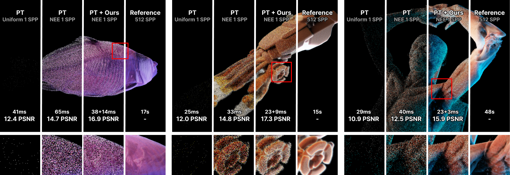

> ## GSCache: Real-Time Radiance Caching for Volume Path Tracing using 3D Gaussian Splatting
> [David Bauer](https://davidbauer.me), [Qi Wu](https://wilsoncernwq.github.io/), [Hamid Gadirov](https://hamidgadirov.github.io), [Kwan-Liu Ma](https://www.cs.ucdavis.edu/~ma/index.html)  
>_IEEE VIS 2025_  
>__[Project Page](https://dbauer15.github.io/papers/gscache/)&nbsp;/ [Paper](https://www.arxiv.org/abs/2507.19718)__

### Code Release Coming Soon!

Official implementation of the 2025 IEEE VIS paper "GSCache: Real-Time Radiance Caching for Volume Path Tracing using 3D Gaussian Splatting"

### Updates
- ✅ [2025/11] Conference presentation in Vienna
- ✅ [2025/07] Paper accepted to IEEE VIS 2025

### BibTex
```
@misc{bauer2025gscache,
      title={GSCache: Real-Time Radiance Caching for Volume Path Tracing using 3D Gaussian Splatting}, 
      author={David Bauer and Qi Wu and Hamid Gadirov and Kwan-Liu Ma},
      year={2025},
      eprint={2507.19718},
      archivePrefix={arXiv},
      primaryClass={cs.GR},
      url={https://arxiv.org/abs/2507.19718}, 
}
```
